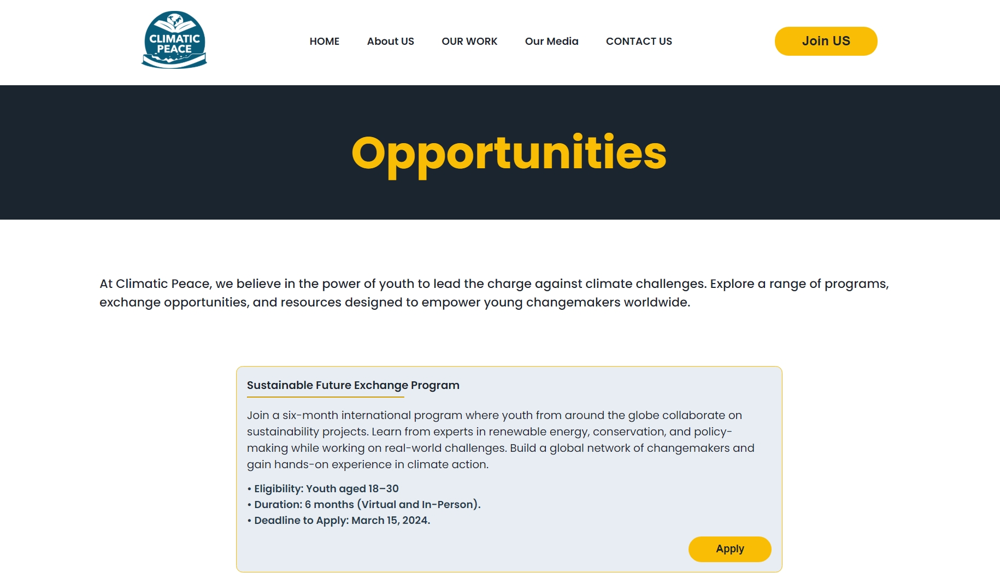
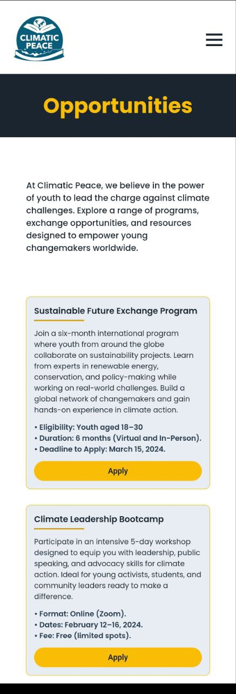

## Overview

Welcome to the **CPF Opportunities Page**! This webpage is dedicated to showcasing various opportunities provided by the **Climatic Peace Foundation (CPF)** for youth. Here, you will find information about exchange programs and other exciting opportunities available.

## Live Site

🌐 Visit the live site [here](https://strong-biscotti-df2a29.netlify.app/).

## Foundation Website

For more information about the Climatic Peace Foundation, visit the [Climatic Peace Foundation - About Us](https://climaticpeace.org/aboutus/).

## Screenshots

### Desktop View

### Mobile View 

## Contact Us

📧 For any inquiries, please contact us at [info@climaticpeace.org](mailto:info@climaticpeace.org).

## Follow Us

Stay connected with us on social media:
- [Facebook](https://facebook.com/climaticpeace)
- [Twitter](https://twitter.com/climaticpeace)
- [Instagram](https://instagram.com/climaticpeace)

## Contributing

We welcome contributions! Please read our [Contributing Guidelines](CONTRIBUTING.md) for more details.

## License

This project is licensed under the MIT License - see the [LICENSE](LICENSE) file for details.

This webpage is dedicated to showcasing various opportunities provided by the Climatic Peace Foundation (CPF) for youth. The page will include information about exchange programs and other opportunities available.

## Live Site

Visit the live site [here](https://strong-biscotti-df2a29.netlify.app/).

## Foundation Website

For more information about the Climatic Peace Foundation, visit [Climatic Peace Foundation - About Us](https://climaticpeace.org/aboutus/).

## Screenshots

### Desktop View

### Mobile View 
